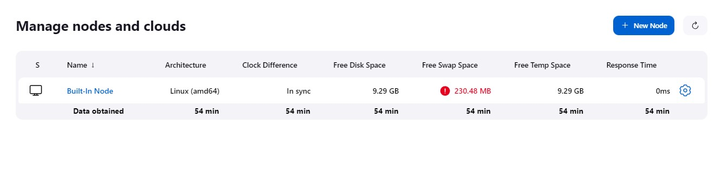
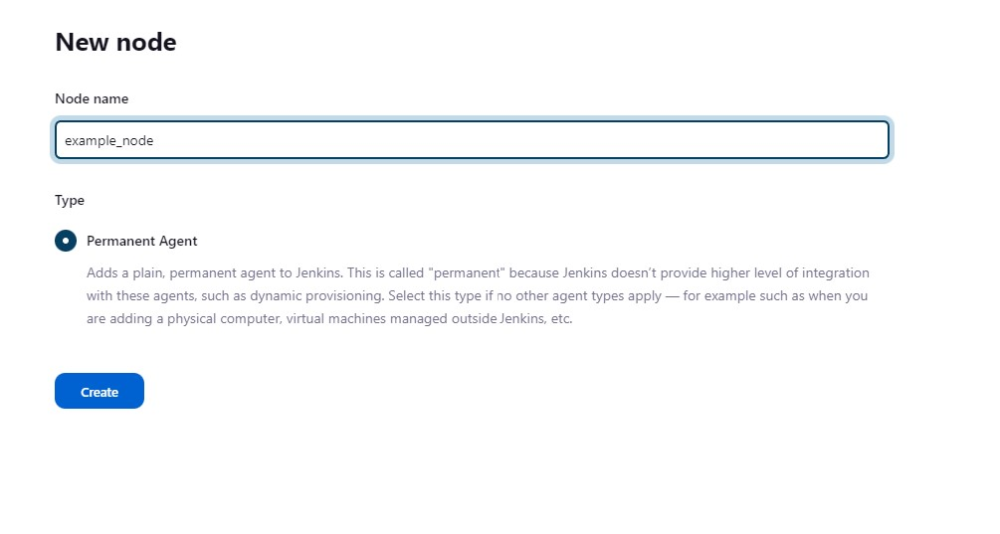
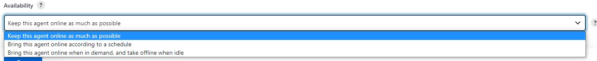
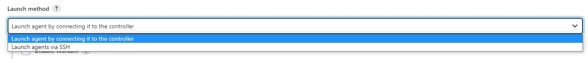
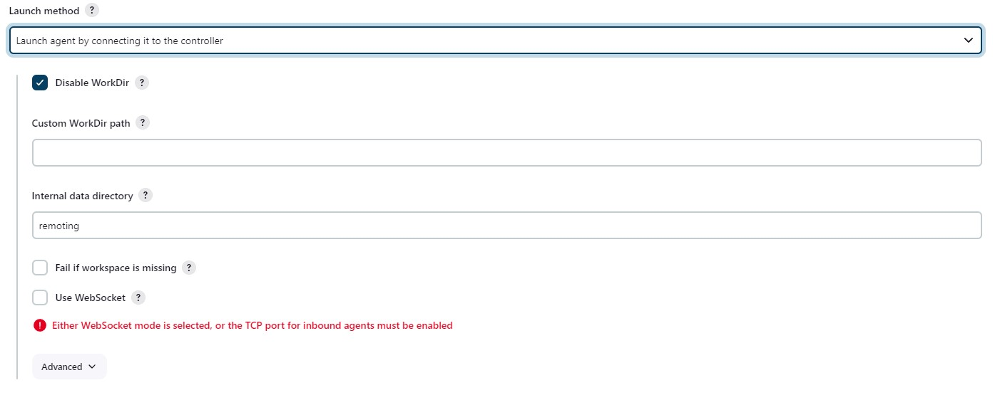
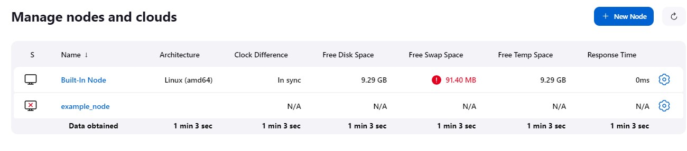

# Jenkins agents
Jenkin agents are machines used to build a Jenkins job. An agent can have multiple executors. Each executor can build one job at a time. So, multiple executors on an agent can build multiple jobs in parallel. Agents are also referred to as Nodes or even Executors. When Jenkins is installed, it creates a _built-in_ node with two executors. So, the built-in node is the machine that is itself running the Jenkins service. 
All the Jenkins nodes including the built-in node can be viewed under _Manage Jenkins > Manage Nodes and Clouds_. There are other ways to access the same such as by clicking the _Build Executor Status_ on the Jenkins homepage or by navigating to the address _<jenkins_url>/computer_ or _<jenkins_url>/manage/computer_.

## Setting up an agent
If there has not been any agent setup, the _Manage Jenkins_ page shows a message to setup an agent. This can be used to setup a agent. 

Navigate to the Jenkins nodes page and click on the _+ New Node_ button as shown in the screenshot Picture.












Save the node setup configuration. The newly setup node can be now visible on the Nodes page with an icon showing a cross. If we click on the node name, it takes us to a page that provides instruction on connecting to the Jenkins controller. However, a port needs to be defined for the agents to connect before the instruction can be seen. For this purpose, navigate to _Manage Jenkins > Configure Global Security > Agents_ and define a port for example as shown in the screenshot Picture. Here a fixed port is chosen, however, a random port can also be chosen. After this, the configuration needs to be saved by clicking the _Click_ button at the bottom of the page.

After defining a port, the node specific page will provide further information, for example as shown in the screenshot Picture.

From the instruction, we get the following information:
* Java is required on the agent.
* A Java library named agent.jar needs to be downloaded to the agent.
* The location/address of the agent on the Jenkins controller is required.
Apart from this, we also get two slightly different ways to run the agent. We can follow one of the ways and perform the action on the agent command line. A better way to run the a service that executes the command on the machine. This ensures that the node gets connected in case the node is restarted if we setup the service to run automatically.
## Jenkins node service

### Example node service creation
```
C:\jenkins>Jenkins-agent.exe status
NonExistent

C:\jenkins>Jenkins-agent.exe install
Installing service 'jenkinsslave_service (jenkinsslave_service)'...
Service 'jenkinsslave_service (jenkinsslave_service)' was installed successfully.

C:\jenkins>Jenkins-agent.exe status
Inactive (stopped)

C:\jenkins>Jenkins-agent.exe start
Starting service 'jenkinsslave_service (jenkinsslave_service)'...
Service 'jenkinsslave_service (jenkinsslave_service)' started successfully.

C:\jenkins>
```

### Troubleshooting
* Make sure that a supported version of Java is installed on the node machine. For example, Jenkins 2.387.2 has support for Java 11 or 17. 
* Visit https://www.jenkins.io/doc/administration/requirements/java/ for more information about Java requirements.


