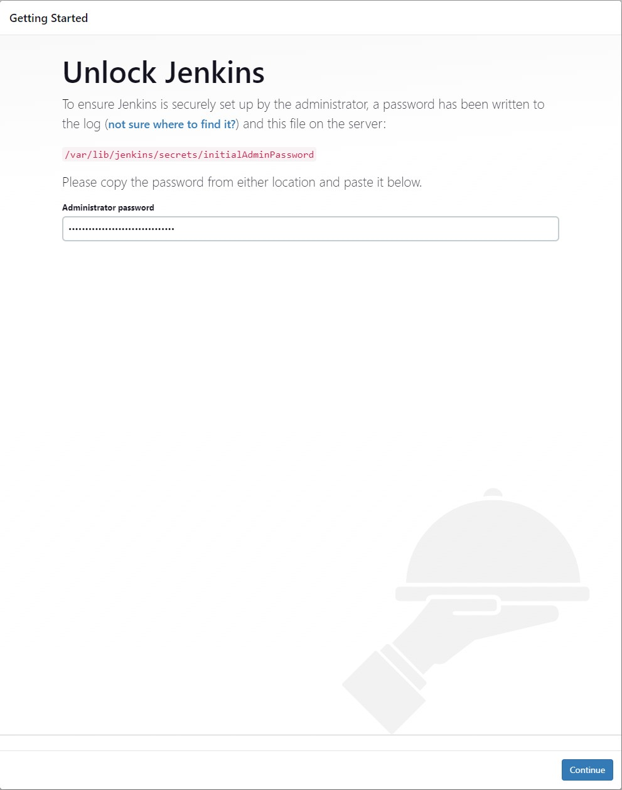
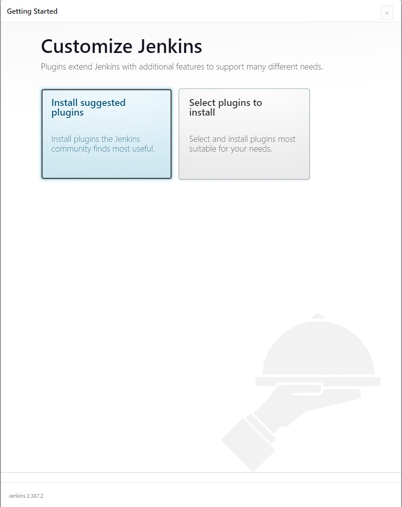
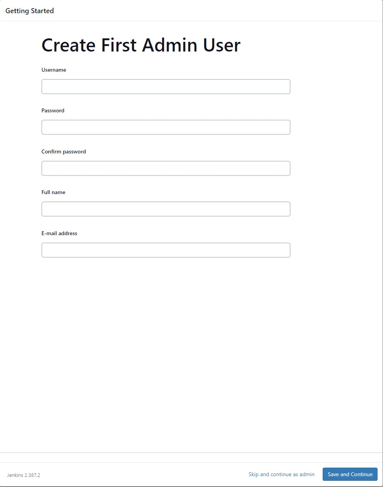
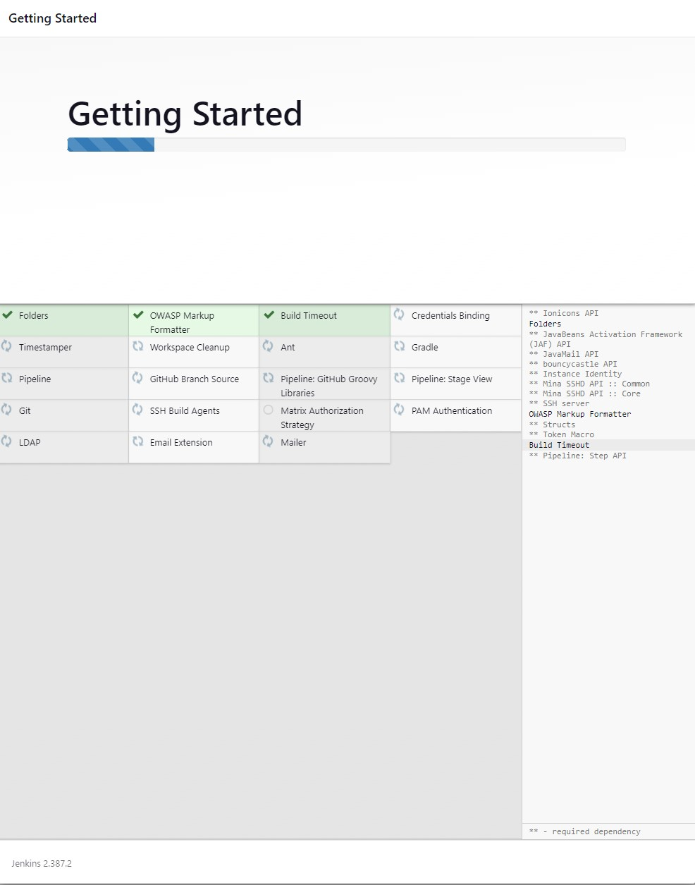
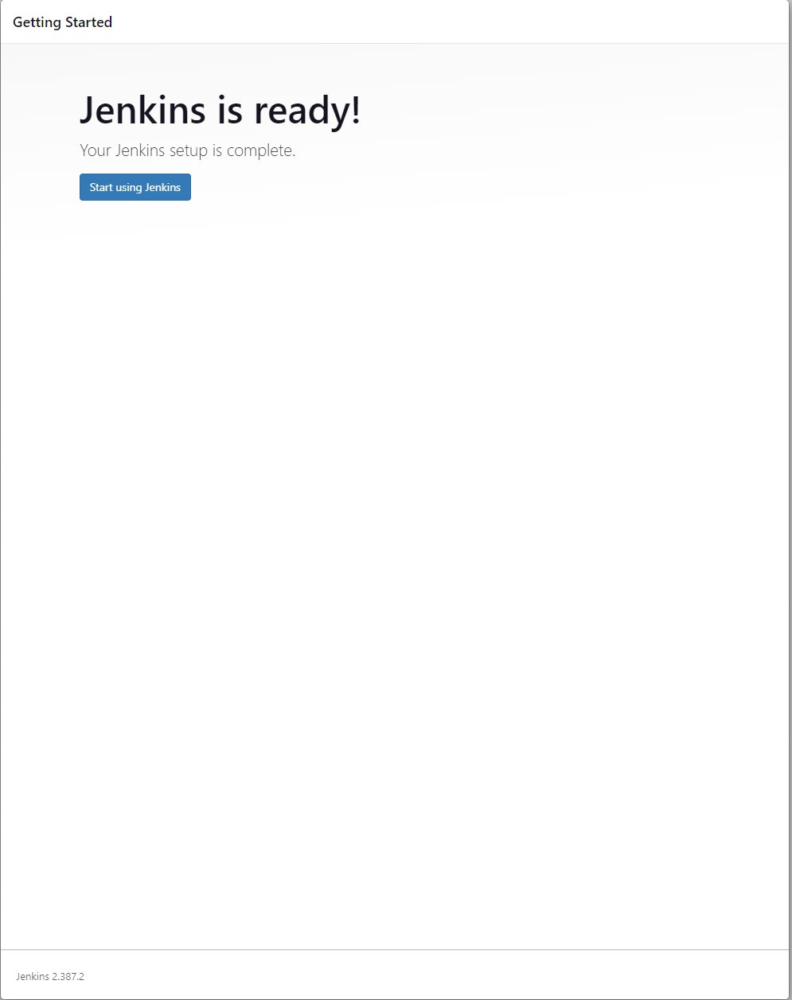
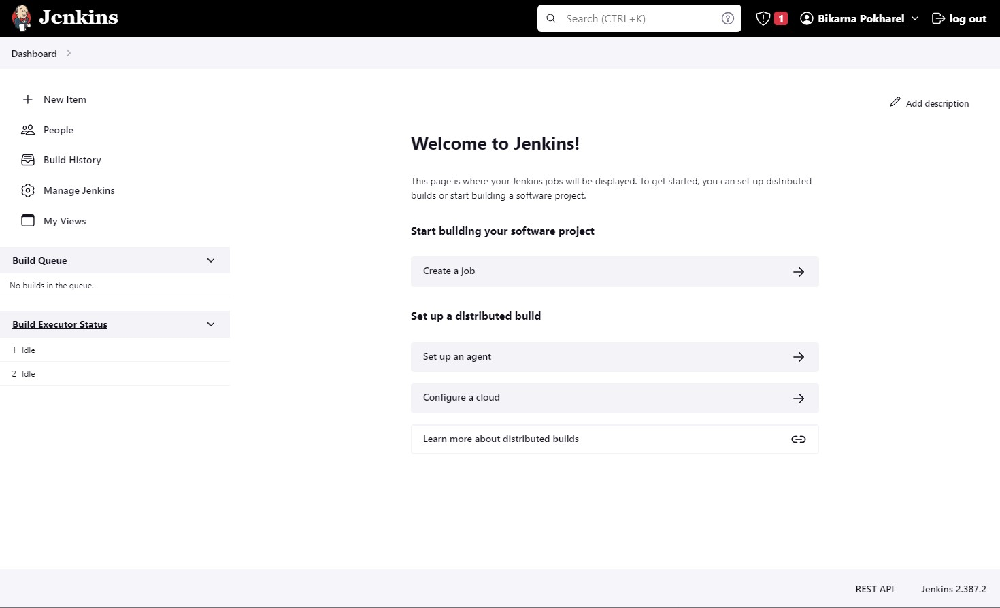

# Intial Setup of Jenkins
After the Jenkins has been successfully installed, it needs to be setup before we can start using it. The initial setup is done by the help of a Getting started wizard that can be accessed by navigating to the browser and entering the address of the server where Jenkins is installed. If the browser used is in the same machine/server where Jenkins is installed, the address is http://localhost:8080. However, if the server is for example a VM or a remote machine, the address is http://<server_ip_address>:8080. For instance if the IP address of the remote server or VM is 192.168.100.23, the address to be entered on the browser address bar is http://192.168.100.23:8080.

The intiai setup includes different steps which are briefly described in the following sections. There is also a [YouTube](https://www.youtube.com/watch?v=dRprQhS0fdg&ab_channel=LearnTeachShare "Initial Setup of Jenkins") tutorial video.

## Unlock Jenkins
After entering the address on the browser, it will display something similar to Picture 1. It asks to enter the initial admin password and also provides the location of the intial admin password file. We need to get the password from that file and enter it in the password field and click OK.

After entering the initial admin password, click on the _Continue_ button

Note that this tutorial considers Jenkins to be installed on Ubuntu/Debian platform. In case it is installed on a Windows machine, the location of the intial admin password file will be different.

## Customize Jenkins
Jenkins features can be extended by using plugins for various needs. There are hundreds of plugins avaialble for Jenkins. Installation of plugins will be described in a different tutorial. However, the initial setup suggests a handful of Jenkins plugins that the Jenkins community finds most useful. It is a good idea to install all the suggested plugins. There is also a possibility to select only the plugins that we are interested in. Picture 2 shows the suggested plugins that would be displayed on the browser screen.

Assuming that the suggested plugins option has been selected, the status of plugins installation is shown on the browser window as shown in Picture 3. The installation process takes some time.

## Create First Admin User
Next step is to crate first admin user. This user will have administrator rights. This user can add other users as administrator. In brief, this user has complete rights on managing Jenkins. In this step we need to enter an admin username, password, full name, and email address. Email address might not be so important at this point, so any email address should work, even an imaginary email address that does not infact exist. Picture 4 shows the Create First Admin User that would appear on the browser window.

After filling the form, click on the _Save and Continue_ button.

## Instance Configuration
In this step, we need to provide the Jenkins URL. It also suggests a default URL. At this stage, accepting the default URL should be fine unless there is a reason to change it. The Instance Confiuration that is shown on the browser window is as shown in Picture 5.

Finally click on the _Save and Finish_ button.

# Start Using Jenkins
After completing the above mentioned steps, the browser displays a Jenkins is Ready! screen as shown in Picture 6.

Click on the _Start using jenkins_ button. This will take us to the Jenkins Dashboard. The dashboard is as shown in Picture 7.

This is all for the initial setup tutorial. In the next tutorial, we will get acquainted to the Jenkins Dashboard.