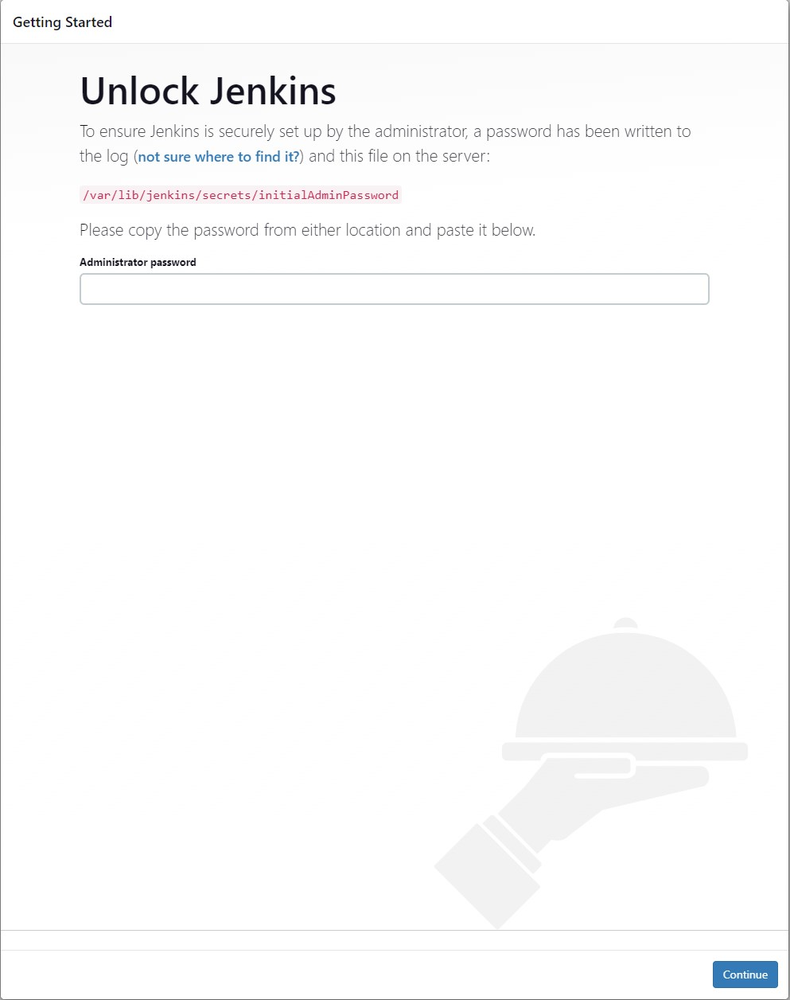

# Installing Jenkins on Ubuntu/Debian machine
_Detailed information can be found from https://www.jenkins.io/download/_

The installation process can also be followed from this [Youtube](https://www.youtube.com/watch?v=YVG1vaPAKak&t=15s&ab_channel=LearnTeachShare "Tutorial video on Jenkins installation on Ubuntu/Debian") tutorial.

## Steps to install
1. The Debian package repository of Jenkins is used to automate installation and upgrade. To use this repository, first add the key to your system:
```
curl -fsSL https://pkg.jenkins.io/debian-stable/jenkins.io-2023.key | sudo tee \
  /usr/share/keyrings/jenkins-keyring.asc > /dev/null
```
2. Then add a Jenkins apt repository entry:
```
echo deb [signed-by=/usr/share/keyrings/jenkins-keyring.asc] \
  https://pkg.jenkins.io/debian-stable binary/ | sudo tee \
  /etc/apt/sources.list.d/jenkins.list > /dev/null
```
3. Update your local package index:
```
sudo apt-get update
```
4. Install Java:
```
sudo apt-get install openjdk-11-jre
```
__Note: At the time of creating this tutorial, Java 11 was supported. For example support for Java 11 will end after September 2024. Refer to https://www.jenkins.io/download/ for updated Java version support information.__

5. Finally install Jenkins:
```
sudo apt-get install jenkins
```

## Test if Jenkins installation has succeeded
Run the command ```sudo systemctl status jenkins```
The output could be for example as follows:
```
  jenkins.service - Jenkins Continuous Integration Server
     Loaded: loaded (/lib/systemd/system/jenkins.service; enabled; vendor preset: enabled)
     Active: active (running) since Fri 2023-04-21 11:17:17 UTC; 2min 6s ago
   Main PID: 820792 (java)
      Tasks: 47 (limit: 2248)
     Memory: 652.2M
     CGroup: /system.slice/jenkins.service
             └─820792 /usr/bin/java -Djava.awt.headless=true -jar /usr/share/java/jenkins.war --webroot=/var/cache/jenkins/war --httpPort=8080

Apr 21 11:16:47 ubuntu jenkins[820792]: d480f791d5b2461ca7fc4bd90f0da4b3
Apr 21 11:16:47 ubuntu jenkins[820792]: This may also be found at: /var/lib/jenkins/secrets/initialAdminPassword
Apr 21 11:16:47 ubuntu jenkins[820792]: *************************************************************
Apr 21 11:16:47 ubuntu jenkins[820792]: *************************************************************
Apr 21 11:16:47 ubuntu jenkins[820792]: *************************************************************
Apr 21 11:17:17 ubuntu jenkins[820792]: 2023-04-21 11:17:17.234+0000 [id=30]        INFO        jenkins.InitReactorRunner$1#onAttained: Completed initialization
Apr 21 11:17:17 ubuntu jenkins[820792]: 2023-04-21 11:17:17.283+0000 [id=22]        INFO        hudson.lifecycle.Lifecycle#onReady: Jenkins is fully up and running
Apr 21 11:17:17 ubuntu systemd[1]: Started Jenkins Continuous Integration Server.
Apr 21 11:17:18 ubuntu jenkins[820792]: 2023-04-21 11:17:18.057+0000 [id=46]        INFO        h.m.DownloadService$Downloadable#load: Obtained the updated data file for hudson.tasks.Maven.MavenInstaller
Apr 21 11:17:18 ubuntu jenkins[820792]: 2023-04-21 11:17:18.059+0000 [id=46]        INFO        hudson.util.Retrier#start: Performed the action check updates server successfully at the attempt #1
```
If the output is similar to shown above, Jenkins installation succeeded.

Another way to see that Jenkins has been installed and running as a service on Ubuntu/Debian,
open a web browser and type in the address http://localhost:8080. Replace localhost with the IP address of the server if applicable.
The browser should render something similar to the Picture 1.


*Picture 1. Jenkins installed confirmation using a browser*


One thing to note here is that Jenkins has been only installed at this point. Further initial setup needs to be completed in order to start using the Jenkins automation server. For that purpose refer to [Initial Setup](https://github.com/bikarnap/jenkins-tutorial/blob/master/installation_and_setup/Initial_Setup.md "Initial Setup")

