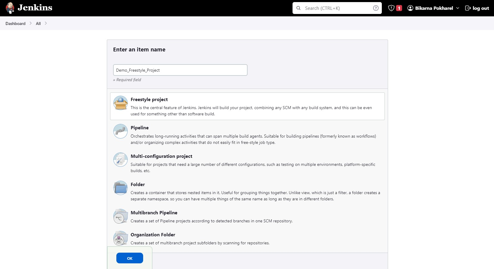
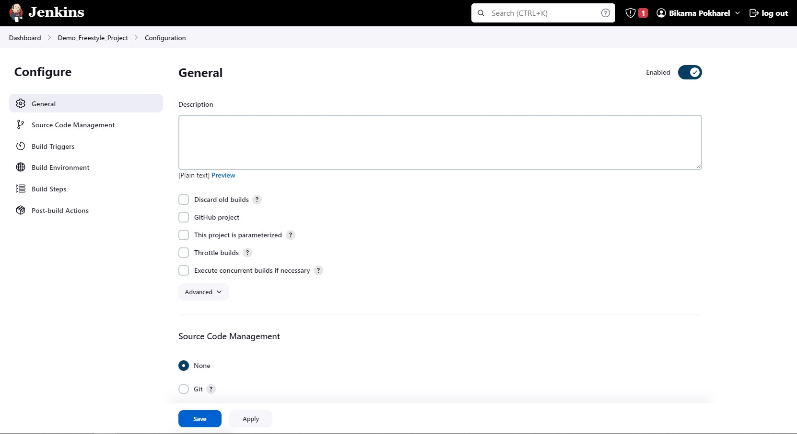
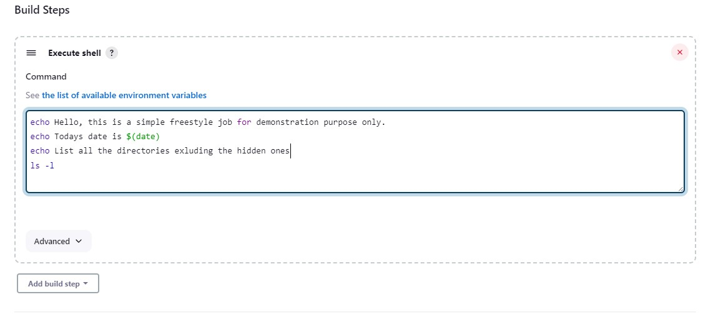
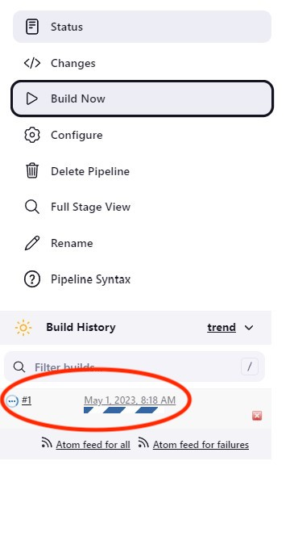
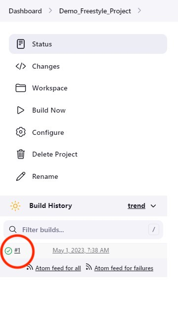
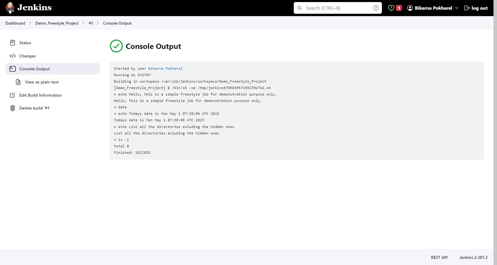

# Job in Jenkins
A job in Jenkins can be as simple as printing a string of text to a complete software development that includes diffrent steps such as build, test, and deploy, among others. In this section of the Jenkins tutorial, we will look into a simple job in Jenkins. We will create a __Freestyle job__ that will run in the Built-in node. A node in Jenkins is a physical or virtual machine that runs the Jenkins agent to execute jobs. Built-in node is the machine where Jenkins controller itself is running.

There is also a [YouTube](https://youtu.be/RcCUoDG_OC4 "YouTube") video that demonstrates creation of a simple Freestyle job.

## Create a new job in Jenkins
In order to create a new Jenkins job, click on the *+ New item* button on the Jenkins home page (Dashboard page). In the screen that appears, give your job a name and select Freestyle as the Project type An example is shown in Picutre 1.

*Picture 1. Creating a freestyle job in jenkins*

Then click on the *OK* button. This will create a new Freestyle job with the given name. You will be taken to the job configuration page after you click the *OK* button. The configuration page is the place where all the things that the job needs and does are configured. For example, Picture 2 shows a Job configuration page.

*Picture 2. Job configuration page screenshot showing part of the configuration*

It can be seen from Picture 2 above, that the job configuration page has multiple configuration menus or sections such as _General_, _Source Code Management_, and _Build Triggers_, among others. Each of the sections can be used to configure specific things. However, the most important section is the _Build steps_ where the things that the job needs to do are configured. For this part, we will keep our job simple. In the _Build Steps_ section of the Job configuration, click on the _Add build step_ button, and select _Execute shell_ (select _Execute Windows batch command_ if Jenkins is installed on a Windows machine). An example build step is shown in Picture 3.

*Picture 3. A simple Jenkins job build step that will execute command on a linux shell*

The build step from the example shown in Picture 3 above executes simple shell commands on a linux machine. The linux machine in this case is the Built-in node. We will save the configuration by clicking on the _Save_ button at the bottom of the configuration page.

## Build a job
After we have a job created and configured, we will be taken to the job page, and we are ready to build that job. Building of a job is really simple. The job page has a menu on the left side named _Build now_, which when clicked starts building the job.

The job build status can be seen from the Build history section on the job page such as the one as shown in Picture 4. 

*Picture 4. Build job status on the Build History section*

The job build can succeed with a status of SUCCESS or fail with a status of FAILURE. No matter what the status is, we can view the console output of the job build by clicking on the circle on the left side of the build number in the Build history section as shown in Picture 5.

*Picture 5. Build status*

An example console output is shown in Picture 6.

*Picture 6. Console output example*

We can also see the information about the job from the Dashboard page. Picture 7 shows an example.

*Picture 7. Example showing the job information on the Jenkins Dashboard page*

This is all for the first job in Jenkins tutorial. 

# Next 
The next tutorial will still be on creating a Freestyle job, but it includes configuration related to archiving artifacts. So the next tutorial will be an extension to this tutorial. Direct link to the next tutorial is [here](./archieveArtifacts.md "here")