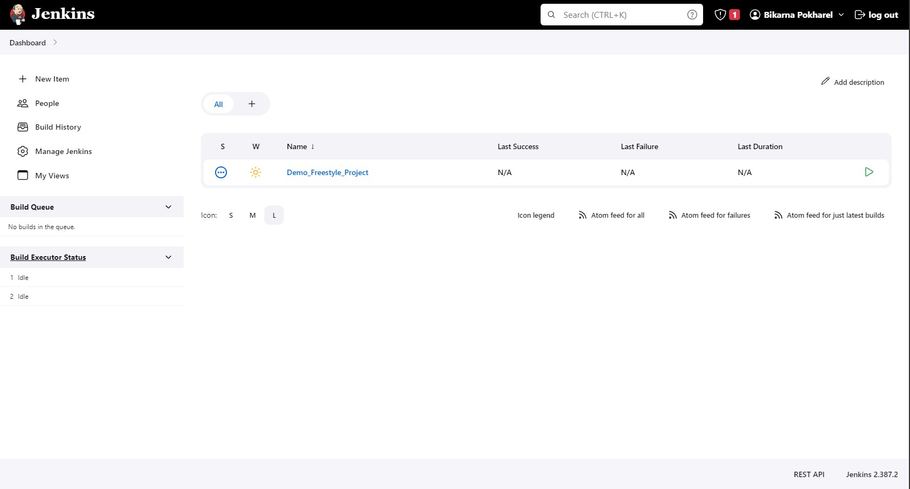

# Jenkins Dashboard
There is also a [YouTube](https://youtu.be/tllInX8dD4U "YouTube") video tutorial on getting to know the Jenkins dashboard and its user interface.

On a freshly installed Jenkins instance, the dashboard is as shown in Picture 1.

*Picture 1. Jenkins Dashboard on a freshly installed Jenkins instance*

When at least one job is added/configured, the dashboard looks different. For example Picture 2 shows the Jenkins dashboard after one job has been configured.

*Picture 2. Jenkins Dashboard showing one job*

# Next step
Now that you have familiarized yourself with the Jenkins Dashboard and its User Interface, we will start creating a job in Jenkins. Direct link to the next tutorial is [here](../jobs/firstJob.md "here")