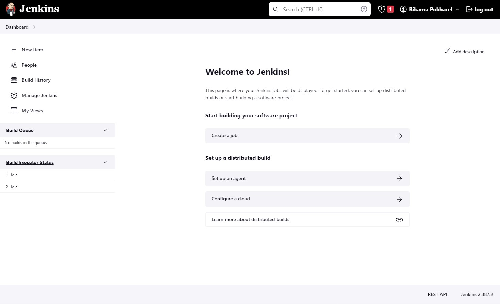

# Jenkins Dashboard
On a freshly installed Jenkins instance, the dashboard is as shown in Picture 1.

When at least one job is added/configured, the dashboard looks different. For example Picture 2 shows the Jenkins dashboard after one job has been configured.

